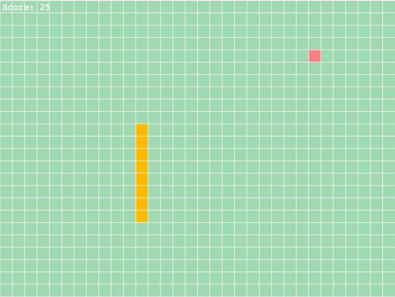

# Snake Game

The classic snake game developed using the Phaser framework.

This project came about as I wanted to branch out of writing games that run in the terminal. I wanted to learn frameworks that allow games to be accessed via the web.



## Installation and Setup Instructions

Make sure you have a Node.js installed.

You can check if you have this installed by running the following command which prints the Node.js version installed on your system.

```
node --version
```

Clone the repo and cd into the repo in your terminal and install the packages.

To install the package run:

```
npm i
```

## Run the Game

Run the game by starting up the server with the following command.

```
npm start
```

When the server has started, open up a browser window and go to http://localhost:3000
